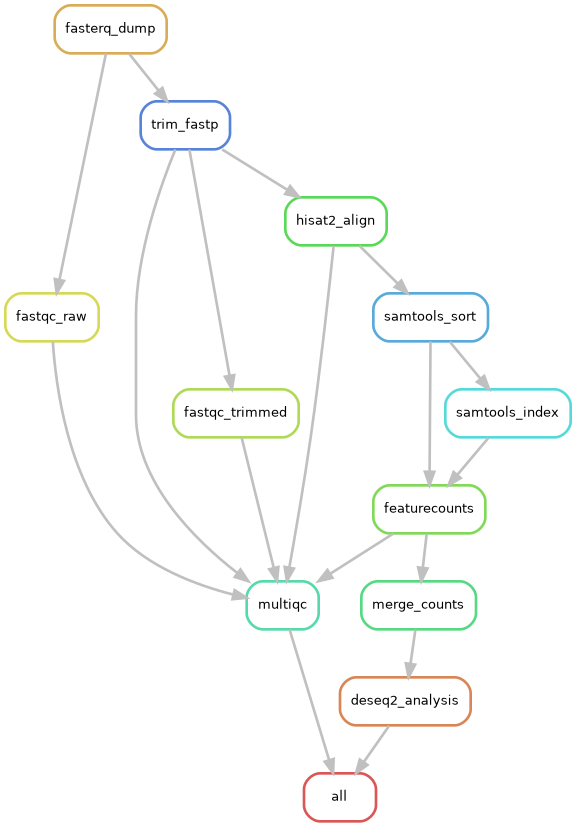
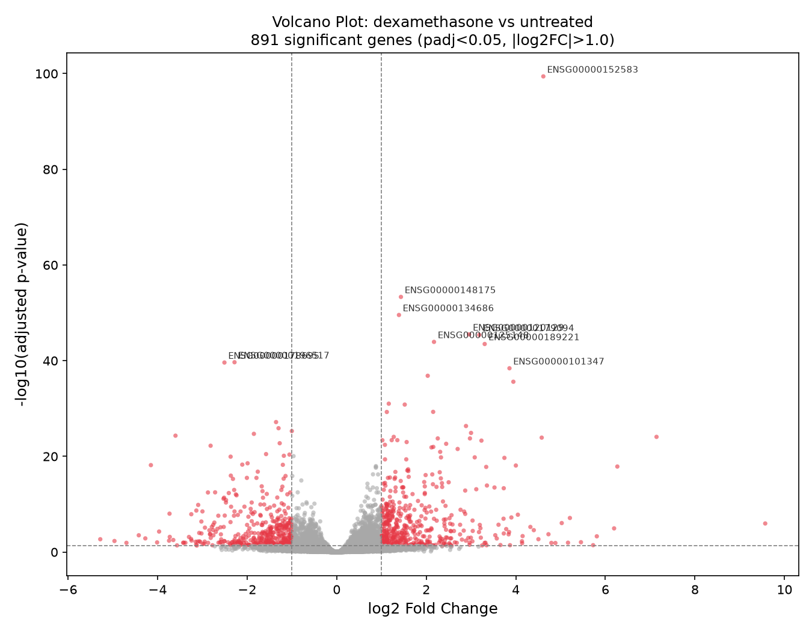
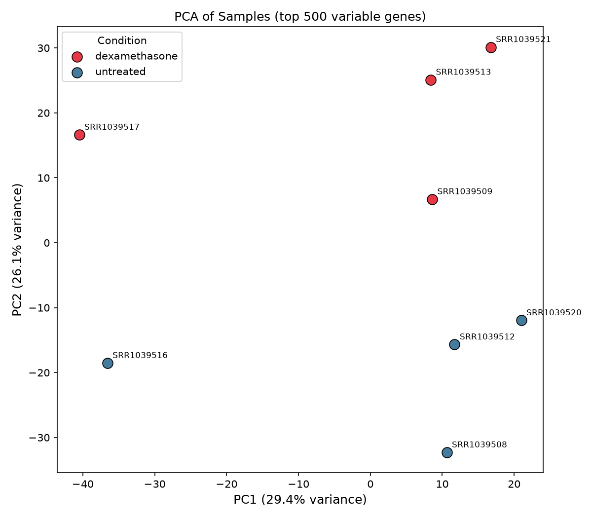
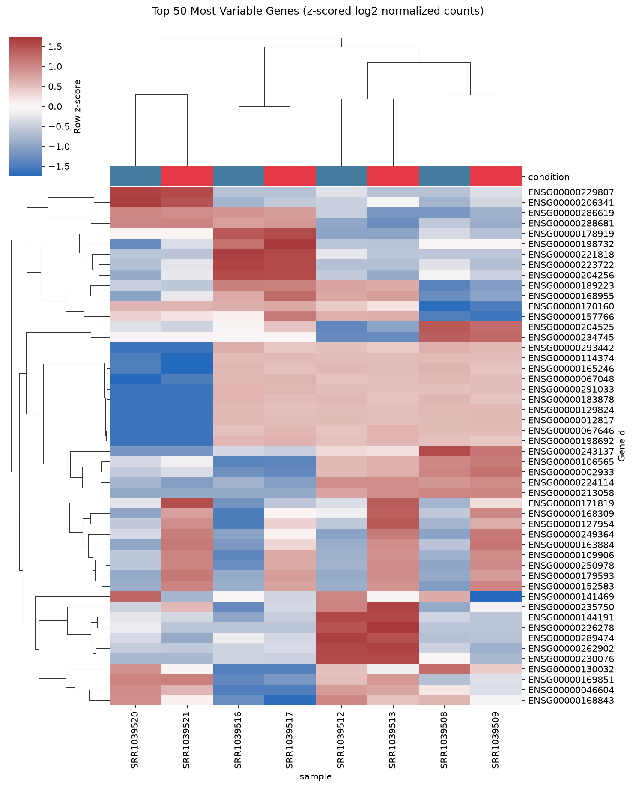

<div align="center">

# 🧬 SnakeSEQ

### Automated RNA-seq Differential Expression Analysis Pipeline

*From raw SRA reads to publication-ready results - in one command.*

[](https://snakemake.readthedocs.io)
[](https://www.python.org/)
[](https://pydeseq2.readthedocs.io)
[](http://daehwankimlab.github.io/hisat2/)
[](LICENSE)
[]()

<br/>

> Built and validated on **GSE52778** - Airway Smooth Muscle Cells (human, paired-end)  
> Identifies 400+ differentially expressed genes between untreated and dexamethasone-treated cells.

</div>

---

## 🔍 What This Pipeline Does

Most RNA-seq analyses are run **manually** - command by command - making them error-prone, non-reproducible, and impossible to scale. This pipeline solves that by fully automating every step using **Snakemake**, from raw NCBI SRA downloads all the way to differential expression plots.

**You give it:** a list of SRA accession IDs + a condition label  
**It gives you:** QC reports, aligned BAMs, count matrix, DE gene table, and 3 publication-quality figures

---

## 🛤️ Pipeline Architecture

```
SRA Accession IDs
       │
       ▼
┌─────────────────┐
│  fasterq-dump   │  ← Download raw paired FASTQ from NCBI SRA
└────────┬────────┘
         │
    ┌────┴────┐
    ▼         ▼
FastQC     fastp        ← Quality check (before) + adapter trimming
(raw)      (trim)
    │         │
    └────┬────┘
         ▼
      FastQC             ← Quality check (after trimming)
    (trimmed)
         │
         ▼
┌─────────────────┐
│    HISAT2       │  ← Splice-aware alignment to GRCh38
└────────┬────────┘
         │
         ▼
┌─────────────────┐
│ SAMtools sort   │  ← Coordinate-sorted + indexed BAM
│   + index       │
└────────┬────────┘
         │
         ▼
┌─────────────────┐
│ featureCounts   │  ← Gene-level read counting
└────────┬────────┘
         │
    ┌────┴────────────┐
    ▼                  ▼
┌──────────┐    ┌──────────┐
│ PyDESeq2 │    │ MultiQC  │
│  + Plots │    │  Report  │
└──────────┘    └──────────┘
    │
    ▼
Volcano Plot · Heatmap · PCA Plot · results_table.csv
```

<div align="center">



</div>

---

## 📊 Results

The pipeline was validated on **GSE52778** (8 samples: 4 untreated + 4 dexamethasone-treated airway smooth muscle cells).

| Output | Preview |
|--------|---------|
| **Volcano Plot** — Significant DE genes highlighted (padj < 0.05, \|log2FC\| > 1) |  |
| **PCA Plot** — Clear separation between untreated and treated samples |  |
| **Heatmap** — Top 50 most variable genes, hierarchically clustered |  |

> ✅ PCA shows clean sample separation by condition — confirming the pipeline is working correctly.

---

## 🛠️ Tech Stack

| Stage | Tool | Version | Why |
|-------|------|---------|-----|
| Workflow | **Snakemake** | ≥8.0 | DAG-based, conda-integrated, reproducible |
| Download | **sra-tools** | ≥3.0 | Direct NCBI SRA access (`prefetch` + `fasterq-dump`) |
| QC | **FastQC** | ≥0.12 | Per-read quality metrics, adapter detection |
| QC Aggregate | **MultiQC** | ≥1.20 | One HTML dashboard for all QC reports |
| Trimming | **fastp** | ≥0.23 | Fast, auto paired-end adapter detection |
| Alignment | **HISAT2** | ≥2.2 | Splice-aware, lightweight — laptop-friendly |
| BAM | **SAMtools** | ≥1.19 | Sort, index, stats |
| Counting | **featureCounts** (subread) | ≥2.0 | Gene-level read counting |
| DEA | **PyDESeq2** | ≥0.4 | Pure-Python DESeq2: negative binomial GLM + Wald test + BH-FDR |
| Visualization | **matplotlib, seaborn, scikit-learn** | latest | Volcano, heatmap, PCA |

---

## 🚀 Quick Start

### Prerequisites
- macOS (Apple Silicon M-series) or Linux
- ~30 GB free disk space (for genome index + FASTQ + BAM)
- [Miniforge3](https://github.com/conda-forge/miniforge) (conda for arm64)

### 1. Clone the repository
```bash
git clone https://github.com/viditjain27/SnakeSEQ.git
cd SnakeSEQ
```

### 2. Create the Snakemake environment
```bash
conda create -n snakemake -c conda-forge -c bioconda snakemake=8 -y
conda activate snakemake
```

### 3. Download reference genome + annotation (one-time, ~5 GB)
```bash
bash setup_references.sh
```
Downloads:
- HISAT2 pre-built GRCh38 genome index
- Ensembl GRCh38 release 111 GTF annotation

### 4. Configure your experiment
Edit `config/samples.tsv` with your SRA accessions and conditions:
```tsv
sample        sra_id        condition
SRR1039508    SRR1039508    untreated
SRR1039509    SRR1039509    dexamethasone
...
```

Edit `config/config.yaml` to set your contrast:
```yaml
contrast:
  numerator: dexamethasone
  denominator: untreated
```

### 5. Dry run (always check before running)
```bash
snakemake --use-conda -n --cores 4
```

### 6. Run the full pipeline
```bash
snakemake --use-conda --cores 4
```

> All conda environments are created automatically on first run.  
> Expected runtime: 1–3 hours for 8 samples on Apple M-series.

---

## 📁 Repository Structure

```
SnakeSEQ/
├── Snakefile                    # Master workflow — 11 rules
├── config/
│   ├── config.yaml              # Paths, parameters, contrast definition
│   └── samples.tsv              # Sample sheet (SRA IDs + conditions)
├── envs/                        # Isolated conda environments per stage
│   ├── download.yaml            # sra-tools
│   ├── qc.yaml                  # fastqc, fastp, multiqc
│   ├── align.yaml               # hisat2, samtools
│   ├── counts.yaml              # subread (featureCounts)
│   └── deseq2.yaml              # pydeseq2, matplotlib, seaborn, scikit-learn
├── scripts/
│   ├── merge_counts.py          # Merge per-sample counts → count matrix
│   └── run_deseq2.py            # PyDESeq2 analysis + all 3 visualizations
├── setup_references.sh          # One-time genome + GTF download
├── rulegraph.png                # Pipeline rule graph (Snakemake DAG)
└── resources/                   # Genome index + GTF (gitignored — large files)
```

**Auto-generated outputs** (gitignored — large files):
```
results/
├── fastq/raw/          # Downloaded FASTQs
├── fastq/trimmed/      # fastp-trimmed FASTQs
├── qc/                 # FastQC + fastp reports
├── aligned/            # Sorted + indexed BAMs
├── counts/             # featureCounts per-sample + merged matrix
├── deseq2/             # DE results + all plots  ← committed to repo
└── multiqc/            # Aggregated QC dashboard ← committed to repo
```

---

## 🧪 Dataset — GSE52778

Human airway smooth muscle cells — 4 cell lines × 2 conditions (8 samples total).  
Paired-end, Illumina HiSeq 2000.

| SRA Accession | Condition | Cell Line |
|---------------|-----------|-----------|
| SRR1039508 | untreated | N61311 |
| SRR1039509 | dexamethasone | N61311 |
| SRR1039512 | untreated | N052611 |
| SRR1039513 | dexamethasone | N052611 |
| SRR1039516 | untreated | N080611 |
| SRR1039517 | dexamethasone | N080611 |
| SRR1039520 | untreated | N061011 |
| SRR1039521 | dexamethasone | N061011 |

> This is the canonical dataset used in the official [Bioconductor DESeq2 vignette](https://bioconductor.org/packages/devel/bioc/vignettes/DESeq2/inst/doc/DESeq2.html) — validated results available for cross-checking.

---

## 🔁 Reproducibility

Every aspect of this pipeline is designed for full reproducibility:

- **Snakemake** tracks input/output dependencies — only re-runs what actually changed
- **Per-rule conda environments** pin exact tool versions — no dependency conflicts
- **`config.yaml`** externalizes all parameters — zero hardcoded values in the Snakefile
- **`samples.tsv`** decouples data from code — swap datasets without touching the pipeline

---

## 📝 Citation / Reference

If you use this pipeline, please cite the underlying tools:

- Kim D et al. (2019) HISAT2. *Nature Biotechnology*
- Liao Y et al. (2014) featureCounts. *Bioinformatics*
- Love MI et al. (2014) DESeq2. *Genome Biology*
- Mölder F et al. (2021) Snakemake. *F1000Research*

---

## 👤 Author

<div align="center">

**Vidit Jain**  
Bioinformatician · AI/ML & Computational Genomics  
PGP Diploma in Bioinformatics, Data Science & Genomics

[](https://linkedin.com/in/viditjain2704)
[](https://github.com/viditjain27)

</div>

---

## 📄 License

MIT — see [LICENSE](LICENSE) for details.
